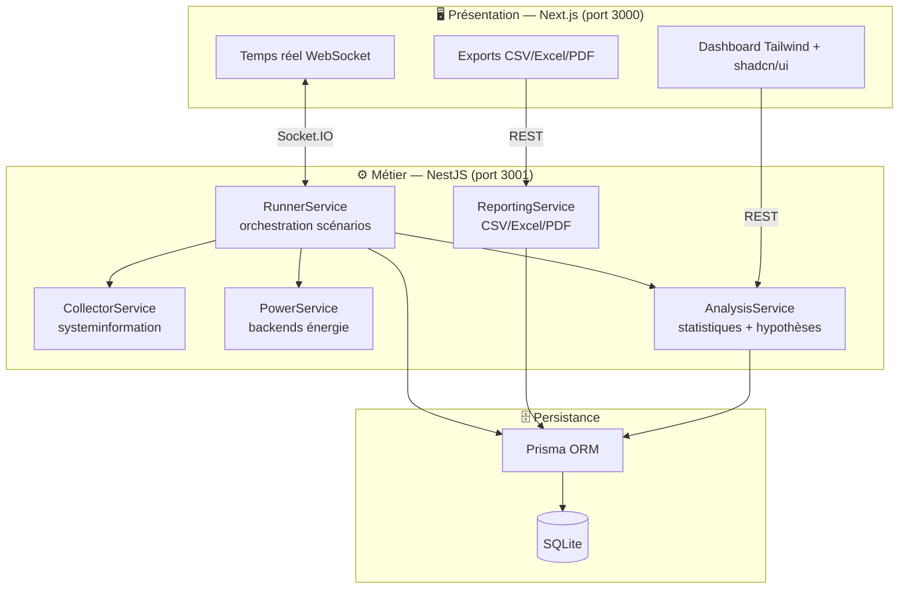
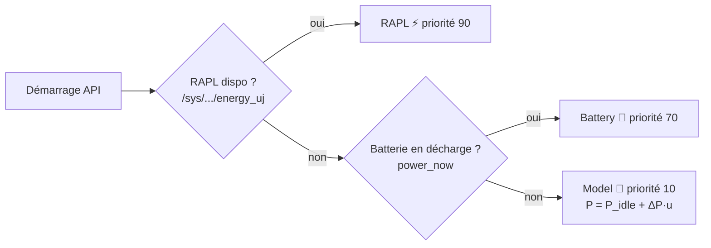
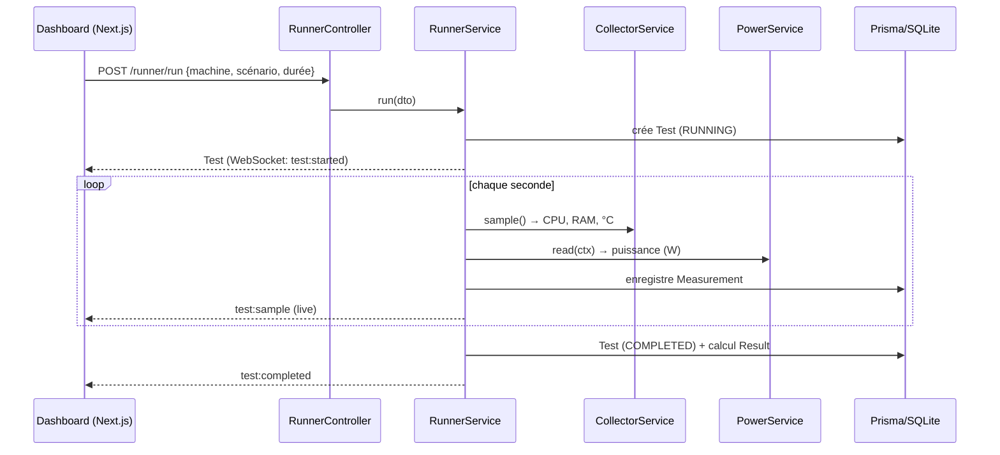

# Architecture technique — EnergieSI

## 1. Vue d'ensemble (couches)



## 2. Sélection du backend énergétique (Strategy + fallback)



Chaque mesure enregistre le backend réellement utilisé (`powerBackend`) pour la transparence scientifique.

## 3. Cycle d'une campagne de mesure



## 4. Stack et choix techniques

| Couche | Technologie | Justification |
|--------|-------------|---------------|
| Frontend | Next.js 14 (App Router) | Rendu serveur, routage moderne, DX. |
| UI | Tailwind CSS + shadcn/ui | Design professionnel, cohérent, rapide. |
| Graphiques | Recharts | Graphiques React déclaratifs. |
| Temps réel | Socket.IO | Diffusion live des échantillons. |
| Backend | NestJS | Architecture modulaire (DI, modules). |
| Capteurs | systeminformation + sysfs | CPU/RAM/°C multiplateforme. |
| Énergie | RAPL / batterie / modèle | Mesure réelle ou estimation, avec repli. |
| Stats | simple-statistics | Moyenne, écart-type, corrélation, test t. |
| ORM/BD | Prisma + SQLite | Zéro configuration, portable. |
| Exports | ExcelJS + PDFKit | Excel et PDF natifs. |

## 5. Organisation du code (monorepo)

```
apps/api    NestJS — 1 module par responsabilité (power, collector, runner,
            analysis, reporting, machines, scenarios, tests)
apps/web    Next.js — pages (overview, realtime, history, compare, hypotheses,
            report) + composants UI réutilisables
packages/shared  Types & enums partagés (contrat unique front/back)
```

## 6. Extensibilité

- **Nouveau backend énergie** (ex : wattmètre Shelly) : implémenter `PowerBackendStrategy` et l'ajouter au `PowerModule`.
- **Nouveau scénario** : ajouter une ligne dans le seed + (option) une charge dédiée.
- **Nouvelle hypothèse** : ajouter une méthode dans `AnalysisService.hypotheses()`.
