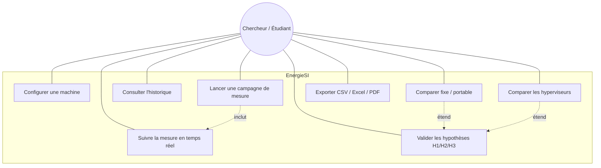
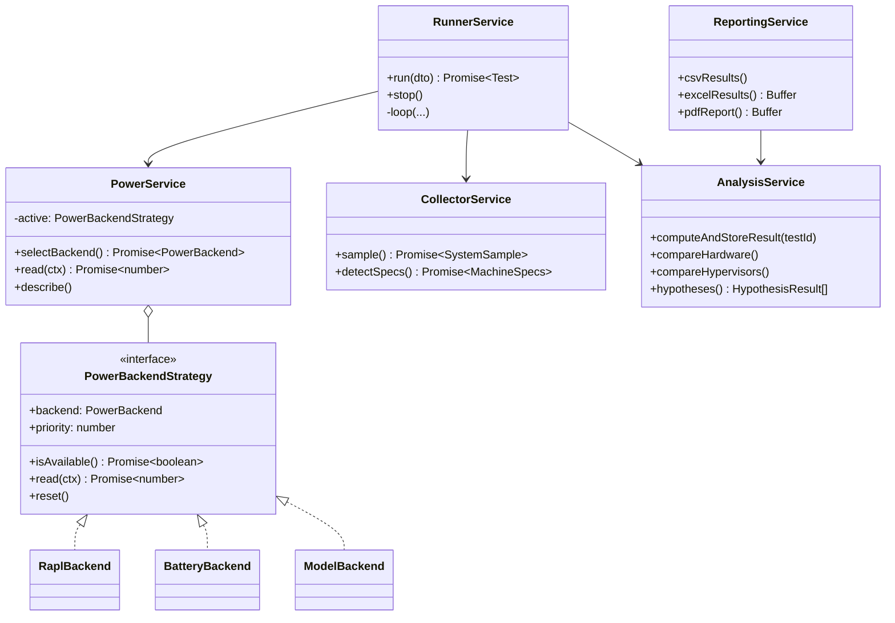
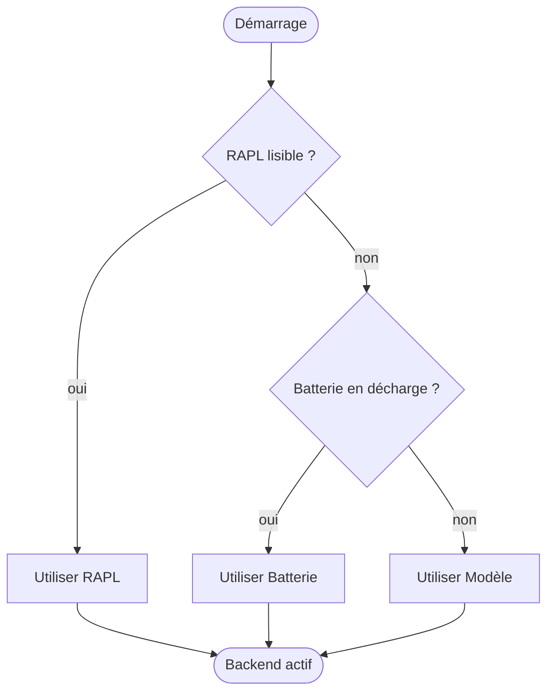

# Diagrammes UML — EnergieSI

> Diagrammes en syntaxe Mermaid (rendus directement sur GitHub / VS Code avec l'extension Mermaid).

## 1. Diagramme de cas d'utilisation



## 2. Diagramme de classes (backend NestJS)



## 3. Diagramme d'entités (modèle de données)

Voir [../02-modele-donnees.md](../02-modele-donnees.md) pour l'ERD complet.

## 4. Diagramme de séquence — exécution d'un test

Voir [../01-architecture.md](../01-architecture.md#3-cycle-dune-campagne-de-mesure).

## 5. Diagramme de déploiement

```mermaid
flowchart LR
    subgraph Poste de mesure (Linux)
        direction TB
        B[Navigateur<br/>localhost:3000]
        N[Next.js<br/>:3000]
        A[NestJS API<br/>:3001]
        DB[(SQLite<br/>dev.db)]
        S[/sys : RAPL, batterie, thermal/]
        B --> N
        N -->|REST + WebSocket| A
        A --> DB
        A -->|lecture capteurs| S
    end
```

## 6. Diagramme d'activité — sélection du backend énergie


